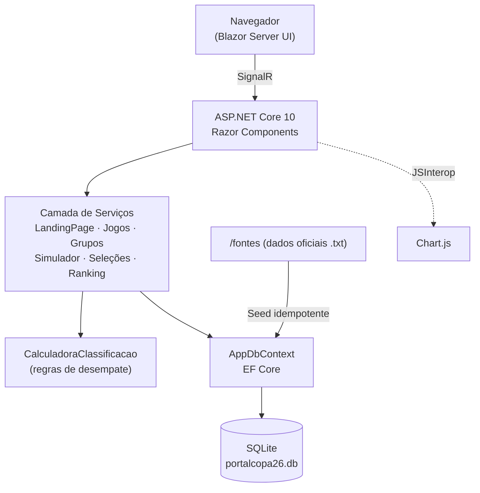

<div align="center">

# ⚽ Portal Copa 2026

### Portal web interativo da Copa do Mundo FIFA 2026 — jogos, grupos, seleções, ranking e simulador de resultados

[](https://dotnet.microsoft.com/)
[](https://learn.microsoft.com/aspnet/core/blazor/)
[](https://learn.microsoft.com/dotnet/csharp/)
[](https://learn.microsoft.com/ef/core/)
[](https://www.sqlite.org/)
[](https://www.chartjs.org/)
[](https://xunit.net/)


</div>

---

## 📋 Sobre o projeto

O **Portal Copa 2026** é uma aplicação web full-stack construída em **Blazor Server (.NET 10)** que centraliza todas as informações da **Copa do Mundo FIFA 2026** — sediada por Estados Unidos, Canadá e México. A aplicação consome dados oficiais (grupos, calendário de jogos, elencos, técnicos e ranking FIFA), persiste tudo em um banco **SQLite via EF Core** e oferece um **simulador interativo** que recalcula a classificação dos grupos conforme o usuário define os resultados.

O torneio conta com **48 seleções**, **12 grupos** de 4 times e **104 partidas** no total, com classificação dos 2 primeiros de cada grupo mais os 8 melhores terceiros colocados.

## ✨ Funcionalidades

- 🏠 **Landing Page** com seções de destaque, próximos jogos, estatísticas e gráfico do ranking FIFA.
- 📅 **Jogos** — calendário completo da primeira fase com filtros por grupo e horários.
- 🏆 **Grupos** — classificação oficial em tempo real com critérios de desempate (pontos, saldo, gols, confronto direto, fair play).
- 🧮 **Simulador** — defina os placares e veja a classificação de cada grupo ser recalculada e persistida.
- 👥 **Seleções** — elencos completos das 48 equipes, com técnicos e fichas dos jogadores.
- 📊 **Ranking FIFA** — tabela pesquisável com posição, pontuação e grupo de cada seleção.

## 🛠️ Tecnologias utilizadas

| Camada | Tecnologia |
|---|---|
| **Frontend / UI** | Blazor Server (Interactive Server Components), Razor, CSS isolado |
| **Backend** | ASP.NET Core 10, C# 13, injeção de dependência |
| **Dados** | Entity Framework Core 10, SQLite, Migrations + Seed idempotente |
| **Visualização** | Chart.js (via JSInterop / `ChartInterop`) |
| **Testes** | xUnit, coverlet |
| **Tooling** | .NET SDK 10, OpenSpec (spec-driven development) |

## 📈 Top 10 — Ranking FIFA (base do projeto)

```text
Argentina    █████████████████████████████████████████  1877.72
Espanha      ████████████████████████████████████████▉  1874.71
França       ████████████████████████████████████████▌  1870.70
Inglaterra   ███████████████████████████████████████    1828.02
Portugal     █████████████████████████████████████▋     1767.85
Brasil       █████████████████████████████████████▌     1765.86
Marrocos     █████████████████████████████████████▎     1755.10
Holanda      █████████████████████████████████████▏     1753.57
Bélgica      ████████████████████████████████████▉      1742.24
Alemanha     ████████████████████████████████████▋      1735.77
```

## 🏗️ Arquitetura



## 🚀 Como executar

**Pré-requisitos:** [.NET SDK 10](https://dotnet.microsoft.com/download) instalado.

```bash
# 1. Clone o repositório
git clone https://github.com/<seu-usuario>/copa2026.git
cd copa2026/prd/src/PortalCopa26

# 2. Restaure as dependências
dotnet restore

# 3. Execute a aplicação (migrations e seed são aplicados automaticamente)
dotnet run --project PortalCopa26

# A aplicação abre em https://localhost:7223
```

> 💡 O banco `portalcopa26.db` é criado e populado automaticamente na primeira execução, a partir dos dados oficiais em `prd/fontes/`. Ele **não** é versionado.

## 🧪 Testes

```bash
cd prd/src/PortalCopa26
dotnet test
```

Os testes (xUnit) cobrem a `CalculadoraClassificacao`, responsável pelos critérios oficiais de classificação dos grupos.

## 📂 Estrutura do projeto

```text
copa2026/
├── .gitignore
├── README.md
└── prd/
    ├── docs/                # Regras de negócio e modelo de dados
    ├── fontes/              # Dados oficiais (grupos, jogos, elencos, ranking)
    ├── openspec/            # Especificações (spec-driven development)
    └── src/PortalCopa26/
        ├── PortalCopa26/        # Aplicação Blazor Server
        │   ├── Components/      # Páginas e componentes Razor
        │   ├── Data/            # DbContext, Migrations, Seed
        │   ├── Models/          # Entidades de domínio
        │   └── Services/        # Lógica de negócio e DTOs
        └── PortalCopa26.Tests/  # Testes xUnit
```

## 📅 Formato do torneio

| Fase | Período | Jogos |
|---|---|---|
| Fase de Grupos | 11–27 jun 2026 | 72 |
| 16-avos (Rodada de 32) | a partir de 29 jun 2026 | 16 |
| Oitavas de Final | a partir de 4 jul 2026 | 8 |
| Quartas de Final | 9–11 jul 2026 | 4 |
| Semifinais | 14–15 jul 2026 | 2 |
| Disputa de 3º lugar | 18 jul 2026 | 1 |
| **Final** | **19 jul 2026 — MetLife Stadium** | **1** |

## 📄 Licença

Distribuído sob a licença MIT. Projeto de caráter educacional; dados da Copa do Mundo FIFA 2026 são de propriedade da FIFA.

---

<div align="center">
Feito com ⚽ e .NET por <strong>César Xavier</strong>
</div>
